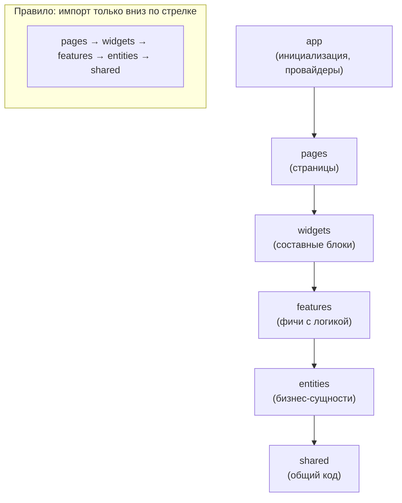
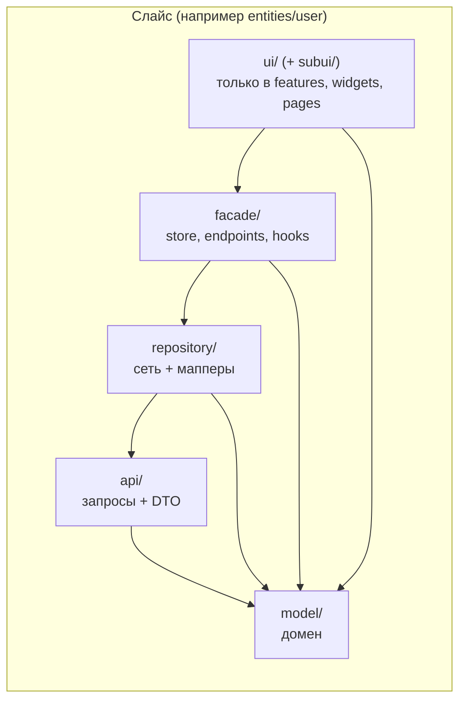
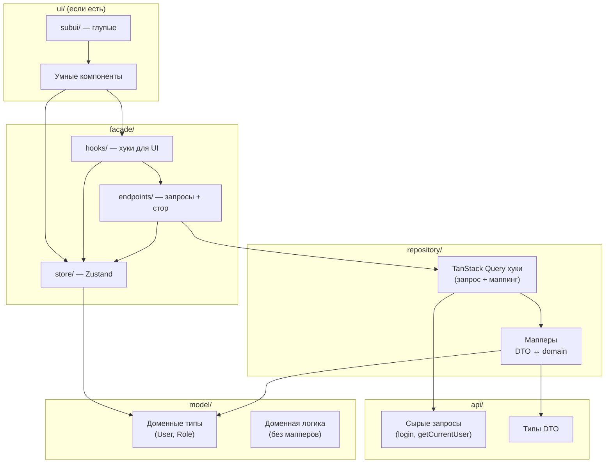

# Архитектура проекта: FSD + DTO–Facade

Документ описывает архитектурный стандарт для фронтенда. Все новые модули и рефакторинг должны ему соответствовать.

---

## 1. Слои FSD (Feature-Sliced Design)

Строго соблюдаем вертикальные слои. Импорты разрешены только **вниз** (от верхних слоёв к нижним).



### Зависимости между слоями

| Слой         | Может импортировать только из              |
| ------------ | ------------------------------------------ |
| **app**      | pages, widgets, features, entities, shared |
| **pages**    | widgets, features, entities, shared        |
| **widgets**  | features, entities, shared                 |
| **features** | entities, shared                           |
| **entities** | shared                                     |
| **shared**   | — (никаких импортов из других слоёв)       |

**Важно:** слой **entities** не содержит UI (ни компонентов, ни разметки). Только данные, типы, API, репозитории, фасад со стором и хуками.

---

## 2. Внутренняя структура слайса (DTO–Facade)

Внутри каждого слайса (например, `entities/user`, `features/auth-by-username`) используется единая структура папок.



### Диаграмма зависимостей внутри слайса



---

## 3. Описание папок внутри слайса

### 3.1. `api/`

- **Назначение:** сырые сетевые запросы и типы DTO.
- **Содержимое:** функции, вызывающие HTTP (через shared/api), и типы с суффиксами `*DTO`, `*RequestDTO`, `*ResponseDTO`.
- **Зависимости:** только `shared` (клиенты, утилиты). Не импортирует `model`, `repository`, `facade`, `ui`.
- **Пример:** `login(credentials)`, `getCurrentUser()`, типы `LoginRequestDTO`, `UserWithProfileDTO`.

### 3.2. `model/`

- **Назначение:** как выглядят доменные данные и как с ними работать (чистая доменная логика).
- **Содержимое:** доменные типы (например, `User`, `Post`), константы и хелперы, ориентированные на домен. Может зависеть от **типов** из `api` (например, для выравнивания с бэкендом), но **не выполняет запросы** и **не трансформирует данные** — мапперов в model нет.
- **Зависимости:** при необходимости только типы из `api` (импорт типов). Не импортирует запросы из api, не импортирует repository/facade/ui.
- **Пример:** `User`, `UserState`, `ROLES`, `Role`, доменные константы.

### 3.3. `repository/`

- **Назначение:** слой сети и трансформаций. Агрегирует вызовы API и преобразования DTO ↔ domain.
- **Содержимое:** мапперы (`mapUserDtoToDomain`, `mapLoginResponseDtoToDomain`, при необходимости `map*DomainToDto`) и TanStack Query хуки, которые вызывают api и прогоняют ответы через мапперы в доменные типы из `model`.
- **Зависимости:** `api`, `model`. Не импортирует `facade` или `ui`.
- **Пример:** `useCurrentUserQuery`, `mapUserDtoToDomain`, `mapLoginResponseDtoToDomain`.

### 3.4. `facade/`

- **Назначение:** единая точка входа для UI: стор, готовые запросы/мутации и высокоуровневые хуки.

- **store/** — определения Zustand-стора и типы состояния.
- **endpoints/** — готовые TanStack Query запросы/мутации, которые при необходимости синхронизируют результат со стором.
- **hooks/** — хуки для UI, объединяющие стор и endpoints.

- **Зависимости:** `repository`, `model` (типы, константы). Не импортирует `ui`.
- **Пример:** `useUserStore`, `useMeQuery`, `useAuthInit`.

### 3.5. `ui/` (только в features, widgets, pages; в entities — нет)

- **Назначение:** компоненты интерфейса.
- **Корневые компоненты (`ui/*.tsx`):** умные — могут использовать фасадные хуки и стор.
- **Папка `subui/`:** глупые компоненты. Только пропсы, без внешних типов (типы приходят от умного родителя). Максимум 4 уровня вложенности.
- **Зависимости:** `facade`, при необходимости типы из `model`. Не импортирует `api` или `repository` напрямую (только через facade/hooks).

---

## 4. Именование

| Что                    | Правило                                         | Примеры                      |
| ---------------------- | ----------------------------------------------- | ---------------------------- |
| Типы API               | суффиксы `*DTO`, `*RequestDTO`, `*ResponseDTO`  | `UserDTO`, `LoginRequestDTO` |
| Доменные типы          | «чистые» имена                                  | `User`, `Post`, `Role`       |
| Мапперы (в repository) | `map[Name]DtoToDomain` / `map[Name]DomainToDto` | `mapUserDtoToDomain`         |

---

## 5. Чек-лист для нового разработчика

1. **Новый слайс** — создавать папки в порядке: `api` → `model` → `repository` → `facade` → `ui` (если слой допускает UI).
2. **Типы с бэкенда** — держать в `api` или переиспользовать из `shared`/общих DTO; домен описывать в `model`.
3. **Трансформация данных** — только в `repository` (мапперы + хуки запросов).
4. **Стор и «удобные» хуки для экранов** — в `facade` (store, endpoints, hooks).
5. **Импорты из другого слайса** — только из barrel-файла (`index.ts`), например `@/entities/user`, `@/features/auth-by-username`.
6. **Entities** — без папки `ui` и без React-компонентов.
7. **Линтер и границы слоёв** — запускать `npm run lint`; нарушения границ (boundaries) будут подсвечены.

---

## 6. Структура репозитория (наглядно)

```
src/
├── app/                    # Инициализация, провайдеры
├── pages/                  # Страницы (композиция widgets + features)
├── widgets/                # Виджеты (api, model, repository, facade, ui + subui)
├── features/               # Фичи (api, model, repository, facade, ui + subui)
├── entities/               # Сущности (api, model, repository, facade — без ui)
│   └── user/
│       ├── api/
│       ├── model/
│       ├── repository/
│       ├── facade/
│       └── index.ts
└── shared/                 # API-клиенты, утилиты, общие компоненты
```

Ссылка на краткий стандарт в коде: [.cursorrules](../.cursorrules).

---

## 7. ESLint и границы слоёв

В проекте включён **eslint-plugin-boundaries**. Он проверяет:

- **boundaries/element-types** — импорты только вниз по слоям (app → pages → … → shared); внутри shared разрешён только импорт из shared.
- **boundaries/entry-point** — импорт слайса только из barrel-файла (`index.ts`/`index.tsx`). Нельзя импортировать внутренние пути вида `@/entities/user/model/types`, только `@/entities/user`.
- **no-restricted-imports** — запрещены глубокие пути в `features`, `entities`, `widgets`, `pages` (обязателен barrel).

Запуск проверки: `npm run lint`. Папка `tests/` в `.eslintignore` и не проверяется на boundaries.
